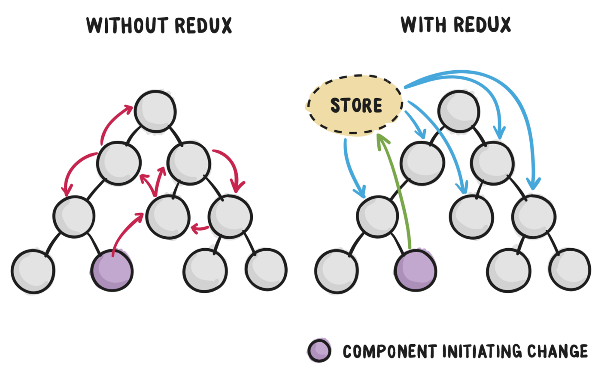

# 📋 Iniciando com Redux

Nesta aula iniciamos os estudos sobre redux, seguindo o exemplo deste artigo: [Iniciando com Redux em 9 passos](https://medium.com/reactbrasil/iniciando-com-redux-c14ca7b7dcf).

## Arquitetura do redux

## Fluxo de uma evolução de estado

