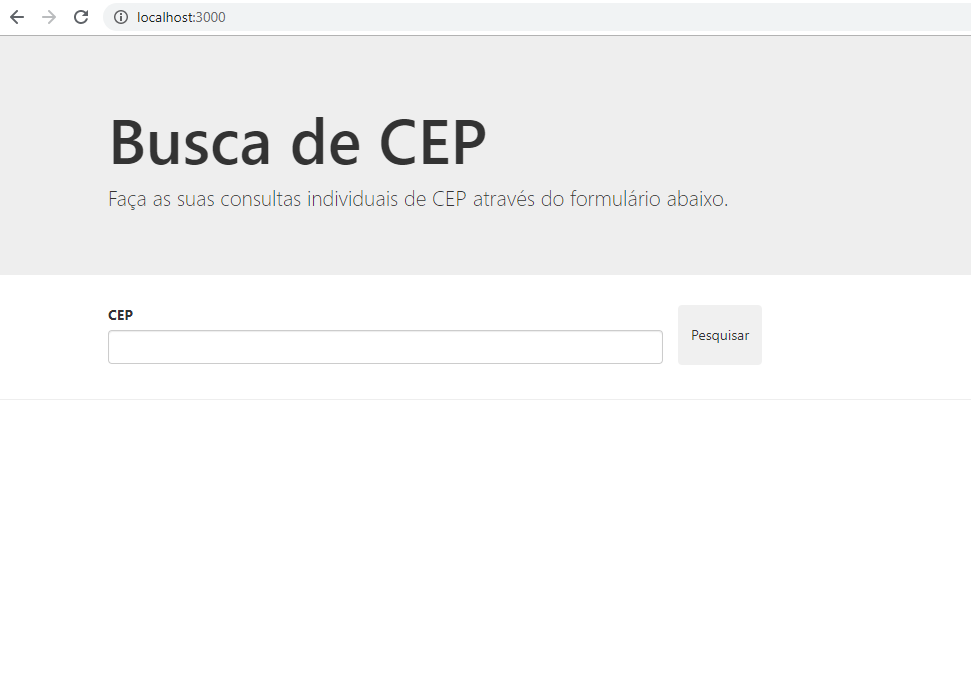
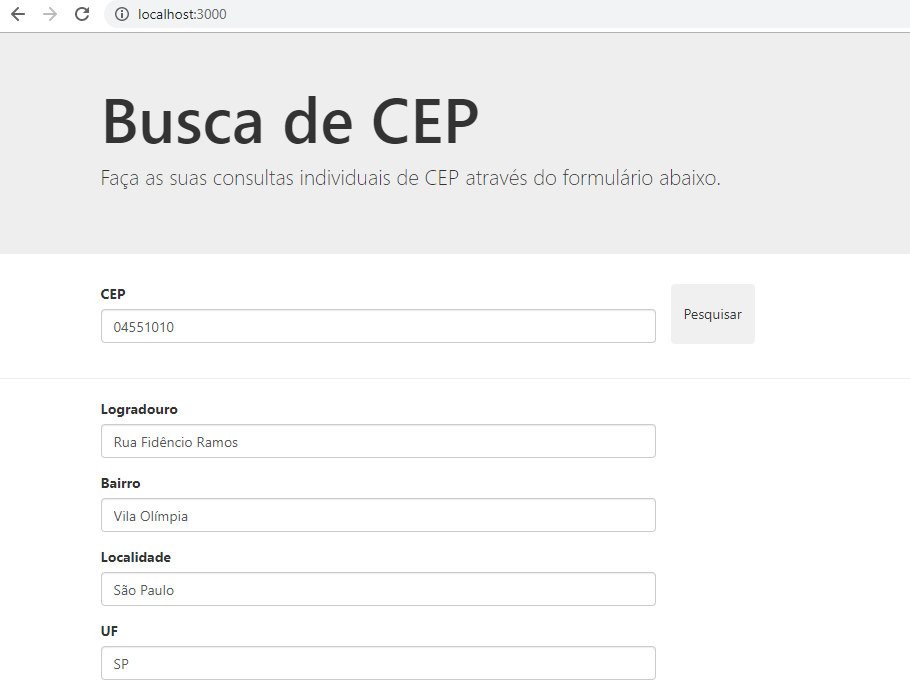

## 🤯 Desafio 2 - Formulário de CEP

Criar um formulário de CEP que preenche todos os campos quando a API responde o endereço.

****
## 🎨 Layout

1. Insira o CEP e clique em pesquisar:



-----

2. O resultado da pesquisa é renderizado:



Obs: Ainda não tem validação.

****

## 🚀 Rodando o projeto localmente

****

## ⚠️ Pré-requisitos:

1. Node.js e NPM instalado (versão 10.x ou acima)

****

1. Clone o projeto na sua máquina

```sh
git clone https://github.com/leticiacamposs2/curso-react-bootcamp.git
```

2. Acesse a pasta do desafio

```sh
cd curso-react-bootcamp/desafios/busca-cep-api
```

3. Instale todas as dependências do projeto

```sh
npm install
```

4. Rode o projeto na sua máquina

```sh
npm start
```

5. Abre o navegador e visualize o projeto

```sh
http://localhost:3000
```

