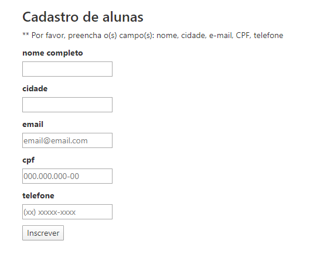

# 🤯 Desafio 1 - Formulário de cadastro de alunas

Fazer um formulário de cadastro de alunas e validar se todos os campos estão preenchidos antes de dar submit, caso não esteja deve exibir a mensagem para o usuário.



****

## 🔧 Funcionalidades:

1. Validação de campo vazio, notificando o usuário
2. Só permite o cadastro da aluna, quando todos os campos tiver preenchido
2. Gravação do cadastro na localStorage do navegador

****

## 🚀 Rodando o projeto localmente

****

## ⚠️ Pré-requisitos:

1. Node.js e NPM instalado (versão 10.x ou acima)

****

1. Clone o projeto na sua máquina

```sh
git clone https://github.com/leticiacamposs2/curso-react-bootcamp.git
```

2. Acesse a pasta do desafio

```sh
cd curso-react-bootcamp/desafios/form-cadastro-alunas
```

3. Instale todas as dependências do projeto

```sh
npm install
```

4. Rode o projeto na sua máquina

```sh
npm start
```

5. Abre o navegador e visualize o projeto

```sh
http://localhost:3000
```