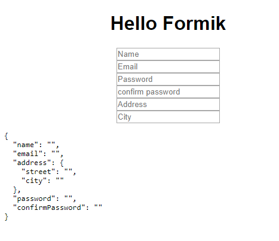

# ♨️ Desafio 9: Criar um formulário usando o formik hook

Criar um formulário utilizando formik hooks conforme o artigo: [Formik hooks — API oficial! 🎉](https://medium.com/@yuriwtoledo/formik-hooks-api-oficial-a79f803970a1)



****

## 🚀 Rodando o projeto localmente

****

## ⚠️ Pré-requisitos:

1. Node.js e Yarn instalado

****

1. Clone o projeto na sua máquina

```sh
git clone https://github.com/leticiacamposs2/curso-react-bootcamp.git
```

2. Acesse a pasta do desafio

```sh
cd curso-react-bootcamp/desafios/formik-hooks
```

3. Instale todas as dependências do projeto

```sh
yarn install
```

4. Rode o projeto na sua máquina

```sh
yarn start
```

5. Abre o navegador e visualize o projeto

```sh
http://localhost:3000
```