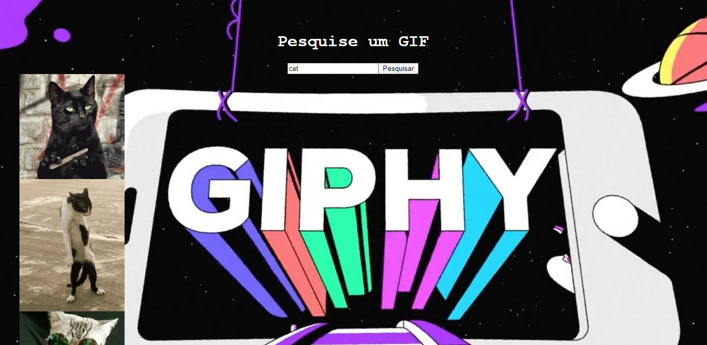

# 🤯 Desafio 7: Consumir uma API com autenticação

A atividade é sobre criar uma aplicação na qual o usuário vai inserir um texto e clicar em pesquisar, abaixo deverá exibir 1 gif relacionado ao que foi digitado no campo.

[Documentação da API](https://developers.giphy.com/docs/api)

***

## 🎉 Resultado final

1. Digite uma palavra no campo e clique em pesquisar;
2. Em seguida visualize do lado esquerdo da tela 5 gifs da palavra pesquisada.



****

## 🚀 Rodando o projeto localmente

****

## ⚠️ Pré-requisitos:

1. Node.js e NPM instalado (versão 10.x ou acima)

****

1. Clone o projeto na sua máquina

```sh
git clone https://github.com/leticiacamposs2/curso-react-bootcamp.git
```

2. Acesse a pasta do desafio

```sh
cd curso-react-bootcamp/desafios/giphy-challenge
```

3. Instale todas as dependências do projeto

```sh
npm install
```

4. Rode o projeto na sua máquina

```sh
npm start
```

5. Abre o navegador e visualize o projeto

```sh
http://localhost:3000
```