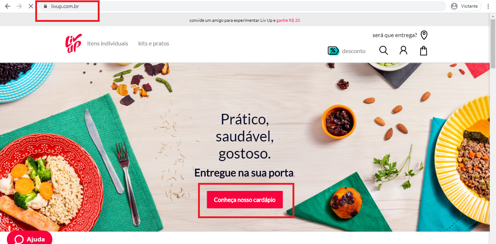
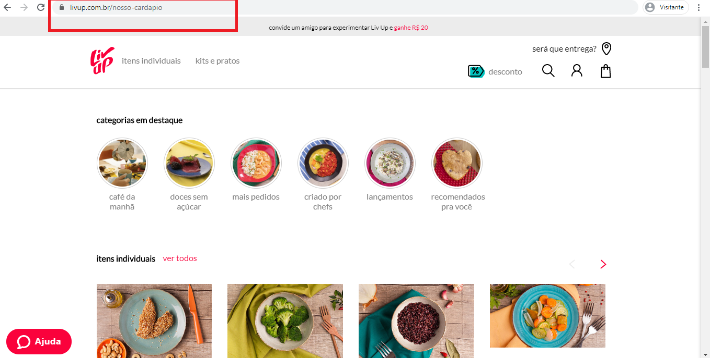

# 🤯 Desafio 6: React router

A atividade é sobre criar rotas no React, sendo que as rotas são aqueles caminhos na URL de um site que nos leva para outra página.

***

## 👀 Exemplo:

Temos o site [livup](https://www.livup.com.br) quando clicamos no botão "Conheça nosso cardápio" a URL do site muda para [livup/nosso-cardapio](https://www.livup.com.br/nosso-cardapio). 

Nesse caso, colocamos um evento de clique no botão para ele redirecionar o site para a rota "/nosso-cardapio" na qual ele vai rederizar outro componente na tela.

Nessa atividade será preciso ler a documentação do react-router e ler um artigo que explica como criar um projetinho simples usando o create-react-app.

***

## 🚀 Projetinhos

1. [Documentação do react-router](./demo-app)
2. [Artigo que explica como criar um projeto simples](./react-com-rotas)
