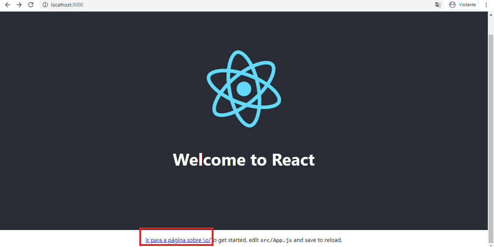

# 🌐 Roteamento no React com os poderes do React Router v4

Seguindo o tutorial do [CollabCode](https://medium.com/collabcode/roteamento-no-react-com-os-poderes-do-react-router-v4-fbc191b9937d) para entender o funcionamento de rotas em React.

***

