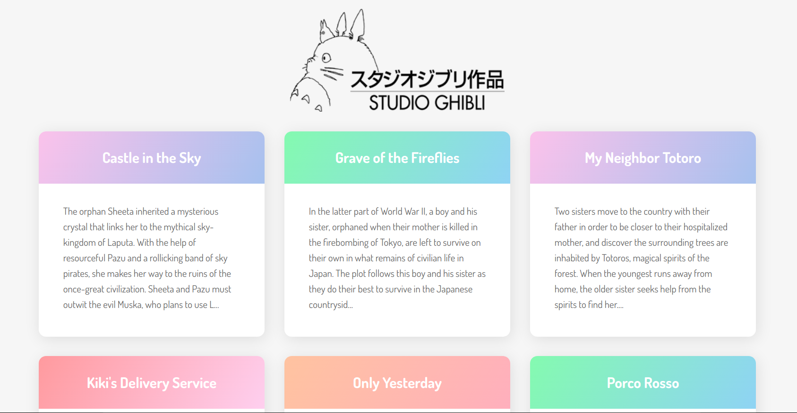

  

# 

# 🤯 Desafio 3: Consumir API do estudio Ghibli 

O objetivo do desafio é criar uma aplicação que lista os filmes do Studio Ghibli. 

Esse é layout de guia:

## Studio Ghibli API

O link da api é esse:

`https://ghibliapi.herokuapp.com`

Será necessário vários recursos para obter diferentes tipos de dados.

Para este desafio devo consumir o seguinte endpoint API:

`https://ghibliapi.herokuapp.com/films`

## Intruções para baixar o projeto

Você pode clonar o projeto ou fazer um fork. 
Com o projeto na sua máquina, entre na máquina e execute: 

`npm install OU yarn install`

## Extra

Utilizar rotas em React, implementando uma página de detalhes para cada filme. 
O esperado é que ao clicar em um card o usuário seja direcionado para a página de detalhes do filme. Se necessário pode consumir outros endpoints da API para popular essa tela.

### Referências

Esse layout foi elaborado pela [@taniarascia](https://github.com/taniarascia).
Aqui tem o [link](https://www.taniarascia.com/how-to-connect-to-an-api-with-javascript/) do artigo onde ela ensina a consumir API's com javascript utilizando esse layout. 