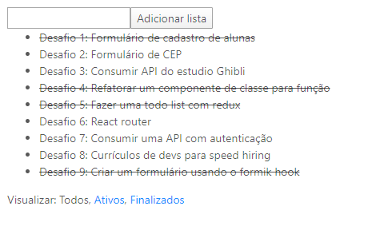

## 🤯 Desafio 5: Fazer uma todo list com redux

Desenvolver uma aplicação que liste tarefas adicionadas, permita indicar se a tarefa está concluída e filtre os tipos de tarefas no footer.



***

****

## 🚀 Rodando o projeto localmente

****

## ⚠️ Pré-requisitos:

1. Node.js e NPM instalado

****

1. Clone o projeto na sua máquina

```sh
git clone https://github.com/leticiacamposs2/curso-react-bootcamp.git
```

2. Acesse a pasta do desafio

```sh
cd curso-react-bootcamp/desafios/todo-list-challenge
```

3. Instale todas as dependências do projeto

```sh
npm install
```

4. Rode o projeto na sua máquina

```sh
npm start
```

5. Abre o navegador e visualize o projeto

```sh
http://localhost:3000
```
